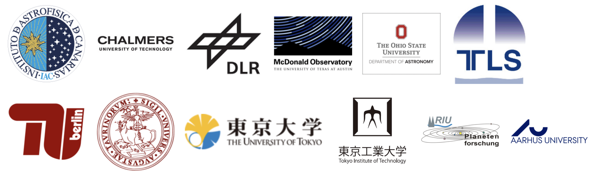

<!--  -->

<!-- ## KESPRINT -->

<!-- [About](about.md) — [Members](members.md) — [Publications](pubs.md) — [Resources](resources.md) -->

We are an international collaboration dedicated to the discovery and characterization of exoplanets using ground-based telescopes. We do not have any guaranteed time for follow-up observations of planet candidates, and relies on open time applications. Nevertheless, our team has an excellent track record in this respect, and we regularly obtain time for: high resolution imaging (AO188@Subaru Telescope, NESSI@WIYN, and FC@TCS); seeing limited photometry (MUSCAT@Okayima, MUSCAT2@TCS, and CAMELOT@IAC80); reconnaissance spectroscopy and moderate-precision radial velocity (FIES@NOT, and Tull@2.7m-McDonald Observatory); highly stable spectrographs (HARPS@3.6m-ESO, HARPS-N@TNG, HDS@SUBARU, CARMENES@CaHa, and HIRES@Keck).

## Members

- Simon Albrecht
- Oscar Barragán
- Paul Beck
- Juan Cabrera
- Ilaria Carleo
- William D. (Bill) Cochran
- Szilard Csizmadia
- Fei Dai
- Hans Deeg
- Jerome de Leon
- Michael Endl
- Anders Erikson
- Massimiliano Esposito
- Malcolm Fridlund
- Davide Gandolfi
- Iskra Georgieva
- Sascha Grziwa
- Eike W. Guenther
- Artie P. Hatzes
- Teruyuki Hirano
- Marshall C. Johnson
- Petr Kabath
- Peter Klagyivik
- Emil Knudstrup
- Judith Korth
- Kristine Lam
- John Livingston
- Rafael Luque
- Savita Mathur
- Norio Narita
- Grzegorz Nowak
- Enric Palle
- Martin Pätzold
- Carina M. Persson
- Heike Rauer
- Seth Redfield
- Luisa Maria Serrano
- Marek Skarka
- Alexis M. S. Smith
- Vincent Van Eylen

## [Publications](pubs.md)



<!-- ## Welcome to GitHub Pages

You can use the [editor on GitHub](https://github.com/kesprint/kesprint.github.io/edit/main/index.md) to maintain and preview the content for your website in Markdown files.

Whenever you commit to this repository, GitHub Pages will run [Jekyll](https://jekyllrb.com/) to rebuild the pages in your site, from the content in your Markdown files.

### Markdown

Markdown is a lightweight and easy-to-use syntax for styling your writing. It includes conventions for

```markdown
Syntax highlighted code block

# Header 1
## Header 2
### Header 3

- Bulleted
- List

1. Numbered
2. List

**Bold** and _Italic_ and `Code` text

[Link](url) and 
```

For more details see [GitHub Flavored Markdown](https://guides.github.com/features/mastering-markdown/).

### Jekyll Themes

Your Pages site will use the layout and styles from the Jekyll theme you have selected in your [repository settings](https://github.com/kesprint/kesprint.github.io/settings/pages). The name of this theme is saved in the Jekyll `_config.yml` configuration file.

### Support or Contact

Having trouble with Pages? Check out our [documentation](https://docs.github.com/categories/github-pages-basics/) or [contact support](https://support.github.com/contact) and we’ll help you sort it out.
 -->
