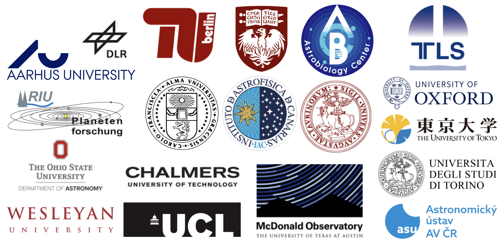

<!--  -->

<!-- ## KESPRINT -->

<!-- [About](about.md) — [Members](members.md) — [Publications](pubs.md) — [Resources](resources.md) -->

## About

<!-- We are an international collaboration dedicated to the discovery and characterization of exoplanets using ground-based telescopes. We do not have any guaranteed time for follow-up observations of planet candidates, and thus we rely on open time applications. Nevertheless, our team has an excellent track record in this regard, and we regularly obtain time for high resolution imaging, seeing limited photometry, reconnaissance spectroscopy, moderate-precision radial velocity monitoring, and highly stable spectrographs.
 -->

KESPRINT is an international consortium of scientists devoted to the detection and characterization of transiting exoplanets found by space-based missions, and was formed from the 2017 merger of the KEST and ESPRINT teams. KESPRINT brings together scientists with a wide range of expertise in light curve analysis, transit detection, radial velocity measurements, spectral analysis, and theoretical interpretation in order to detect, characterize, and understand exoplanetary systems. We are organised into several working groups, namely planet detection, follow-up observations, modelling, and atmospheric characterization. Our Steering Committee is elected annually and is currently chaired by [Hans Deeg](mailto:hdeeg@iac.es).
 
## [Publications](pubs.md)

## Members

<!-- - Simon Albrecht
- Oscar Barragán
- Paul Beck
- Juan Cabrera
- Ilaria Carleo
- William D. (Bill) Cochran
- Szilard Csizmadia
- Fei Dai
- Hans Deeg
- Jerome de Leon
- Michael Endl
- Anders Erikson
- Massimiliano Esposito
- Malcolm Fridlund
- Davide Gandolfi
- Iskra Georgieva
- Sascha Grziwa
- Eike W. Guenther
- Artie P. Hatzes
- Teruyuki Hirano
- Marshall C. Johnson
- Petr Kabath
- Peter Klagyivik
- Emil Knudstrup
- Judith Korth
- Kristine Lam
- John Livingston
- Rafael Luque
- Savita Mathur
- Norio Narita
- Grzegorz Nowak
- Enric Palle
- Martin Pätzold
- Carina M. Persson
- Heike Rauer
- Seth Redfield
- Luisa Maria Serrano
- Marek Skarka
- Alexis M. S. Smith
- Vincent Van Eylen -->

<!-- to convert above list to multi column html paste into tmp file and run
cat tmp | awk -F"- " '{print "<td>"$2"</td>"}'
then manually insert </tr><tr> every 3 names for 3 columns
 -->
 
<table border="0">
<!--  <tr>
    <td><b style="font-size:30px">Title</b></td>
    <td><b style="font-size:30px">Title 2</b></td>
 </tr> -->
 <tr>
   <td>Simon Albrecht</td>
   <td>Oscar Barragán</td>
   <td>Paul Beck</td>
 </tr>
 <tr>
   <td>Juan Cabrera</td>
   <td>Ilaria Carleo</td>
   <td>William D. (Bill) Cochran</td>
 </tr>
 <tr>
   <td>Szilard Csizmadia</td>
   <td>Fei Dai</td>
   <td>Hans Deeg</td>
 </tr>
 <tr>
   <td>Jerome de Leon</td>
   <td>Michael Endl</td>
   <td>Anders Erikson</td>
 </tr>
 <tr>
   <td>Massimiliano Esposito</td>
   <td>Malcolm Fridlund</td>
   <td>Davide Gandolfi</td>
 </tr>
 <tr>
   <td>Iskra Georgieva</td>
   <td>Sascha Grziwa</td>
   <td>Eike W. Guenther</td>
 </tr>
 <tr>
   <td>Artie P. Hatzes</td>
   <td>Teruyuki Hirano</td>
   <td>Marshall C. Johnson</td>
 </tr>
 <tr>
   <td>Petr Kabath</td>
   <td>Peter Klagyivik</td>
   <td>Emil Knudstrup</td>
 </tr>
 <tr>
   <td>Judith Korth</td>
   <td>Kristine Lam</td>
   <td>John Livingston</td>
 </tr>
 <tr>
   <td>Rafael Luque</td>
   <td>Savita Mathur</td>
   <td>Felipe Murgas</td>
 </tr>
 <tr>
   <td>Norio Narita</td>
   <td>Grzegorz Nowak</td>
   <td>Enric Palle</td>
 </tr>
 <tr>
   <td>Martin Pätzold</td>
   <td>Carina M. Persson</td>
   <td>Heike Rauer</td>
 </tr>
 <tr>
   <td>Seth Redfield</td>
   <td>Luisa Maria Serrano</td>
   <td>Marek Skarka</td>
 </tr>
 <tr>
   <td>Alexis M. S. Smith</td>
   <td>Vincent Van Eylen</td>
 </tr>
</table>



<!-- ## Welcome to GitHub Pages

You can use the [editor on GitHub](https://github.com/kesprint/kesprint.github.io/edit/main/index.md) to maintain and preview the content for your website in Markdown files.

Whenever you commit to this repository, GitHub Pages will run [Jekyll](https://jekyllrb.com/) to rebuild the pages in your site, from the content in your Markdown files.

### Markdown

Markdown is a lightweight and easy-to-use syntax for styling your writing. It includes conventions for

```markdown
Syntax highlighted code block

# Header 1
## Header 2
### Header 3

- Bulleted
- List

1. Numbered
2. List

**Bold** and _Italic_ and `Code` text

[Link](url) and 
```

For more details see [GitHub Flavored Markdown](https://guides.github.com/features/mastering-markdown/).

### Jekyll Themes

Your Pages site will use the layout and styles from the Jekyll theme you have selected in your [repository settings](https://github.com/kesprint/kesprint.github.io/settings/pages). The name of this theme is saved in the Jekyll `_config.yml` configuration file.

### Support or Contact

Having trouble with Pages? Check out our [documentation](https://docs.github.com/categories/github-pages-basics/) or [contact support](https://support.github.com/contact) and we’ll help you sort it out.
 -->
